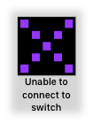

# STAC Communications

## Introduction

Short techie document describing the way a STAC communicates with a Roland device using the Smart Tally protocol.

This is only relevant if you are using a STAC in an emulated environment. That is, where the STAC is not communicating with a physical Roland device but is operating in a system that emulates a Roland device using the Smart Tally protocol.

 

## Initiation

When using a smart device or computer with a full browser implementation, the initial connection sequence to the Roland switch via that devices' web browser will cause the Roland switch to send a web page containing a set of scripts used by the browser allowing the user to select a specific tally channel to monitor and then for subsequent status requests to the Roland switch.

The STAC, having no capacity to run the scripts sent by the Roland switch, bypasses that initial initialization sequence. It instead establishes a connection to the Roland switch and then immediately starts to poll the Roland switch for the tally status of the channel selected by the user during setup of the STAC. 

 

## Status Request

When operating, the STAC continuously polls the Roland switch by sending to it an ASCII character string in the following format:

    `GET /tally/[number]/status`  
    followed by a `<return>` and a `<newline>` character.
 
Where: `[number]` is the ASCII integer representation of the tally channel number of the Roland device for which status is being requested; `1` to `8`.
 
This string is sent to the IP address and port number specified by the user when the STAC is configured via a web browser. Refer to the *STAC Users Guide.md* in this repository.

 

## Expected Response

The STAC is expecting a response to a status request to be an ASCII character string that is exactly one of: 
 
    `onair`  
    `selected`  
    `unselected`  

With no `<return>` or `<newline>` characters appended.

Capitalization is significant.

Any other response will cause the STAC to display an error state as described in the *Troubleshooting* section of the *STAC Users Guide.md*.

 

## Timeout Tracking

During operation, if the STAC does not hear back from the Roland device a purple X will appear on the STAC.

This is because the STAC has not received a response from the Roland in sufficient time.  Sometimes this is because the server is down, but other times it may be due to latency over the wireless connection. 

In order to prevent "un-necessary" confusion to the camera operator, whereby the STAC switches in and out of the purple X, we have added timeout tracking. This is described in more detail in the user manual.

 

## Other Considerations

The STAC sends no identifiable information directly in the status request. Thus in emulated environments, using the requested tally channel number as a STAC  identifier may limit the number of physical STACs that can be used.

Other methods, such as using the MAC address or IP address assigned to a STAC from the router, may be considered.

---
### Revision History
**2021-04-08:** Add "Other Considerations" section. Correct typos.  
**2021-04-05:** First release.

 
