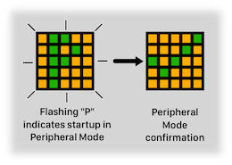

# Peripheral Mode Guide
## STAC v3.0

**Authors:** Team STAC
 

---

## Overview

Often on video camera rigs, two STACs are used. One facing the camera operator and one facing the stage talent. Since the units act as an operator-talent pair, Peripheral Mode allows one STAC to receive its tally information from the other.

The one STAC becomes the tally controller and the second becomes a tally peripheral to the controller. This reduces the traffic on the WiFi network and simplifies power cabling at the camera.

Starting with STAC v3.0, Peripheral Mode is enabled via software—no hardware jumper is required.

 

---

## Enabling Peripheral Mode

You will need two STACs. Each STAC must be running software version 3.0 or later.

First, remove all power from each STAC.

For the STAC you want to operate in Peripheral Mode:

1. Connect one end of a USB-C cable to the STAC and the other end to a 5VDC power supply.
2. Immediately after power is applied, press and hold the Display button.
3. After a short delay, the display will flash a green "P" glyph several times—this indicates the STAC is ready to be placed into Peripheral Mode.
4. Release the button while the green "P" is flashing.

The STAC will save the Peripheral Mode setting to its internal memory and immediately enter Peripheral Mode, showing a green confirmation checkmark followed by the orange power-on glyph.

⚠️ <b>IMPORTANT</b> ⚠️

<b>Confirm that the Peripheral Mode STAC is showing the green "P" startup sequence before connecting the GROVE cable between the two STACs.</b>

 

Once Peripheral Mode is confirmed:

1. Remove power from the Peripheral Mode STAC.
2. Connect the two STACs with a 4-pin GROVE cable.
3. Connect one end of a USB-C cable to the controller STAC (the one NOT in Peripheral Mode) and the other end to a 5VDC power supply.

Only one of the STACs should be powered via its USB-C port. The Peripheral Mode STAC is powered through the GROVE cable from the controller STAC.

⚠️ **DO NOT** connect a USB cable to both STACs when the GROVE cable is connected. Bad things will occur.

 

---

## Operation

On power up or restart, a STAC in Peripheral Mode will flash a green "P" on an orange background a few times, then display a green confirmation checkmark and then start operating in Peripheral Mode.

All normal operation state and features of the STAC are disabled. The STAC will not connect to a WiFi network, nor poll the Roland switch and it will ignore the normal Tally Channel, Tally Display Mode and Startup Mode settings. All tally information is received from the other (controller) STAC via the GROVE cable.

When in Talent mode, the display will be just as described in the main User's Guide. It will show red if the video channel being monitored by the controller STAC is in Program or onair and it will be green otherwise.

If set to Camera Operator mode, the display shows:

- **RED** when the channel is in PGM (Program or onair)
- **GREEN** when the channel is in PVW (Preview or selected)
- **"PURPLE DOTTED"** when the channel is not in either PGM or PVW (unselected)
- **Orange X** for any unknown or error state

The display Brightness Level and Tally Display Mode select features are available in Peripheral Mode.

### Setting the Brightness Level

1. Press and hold the button. In about two seconds, the STAC moves to its Brightness Level select state with the current brightness level displayed.
2. Release the button.
3. Click the button to pick the new level.
4. Press and hold the button and the new level is confirmed by showing the green confirmation checkmark. Release the button and the STAC returns to monitor the tally status.

### Setting the Tally Display Mode

Flipping between the two modes (Talent and Camera Operator) is done like so:

1. Press and hold the button. In about two seconds, the current Brightness Level will be displayed.
2. Keep holding the button down until the current Tally Display Mode is shown. The STAC will already be in select state.
3. Release the button.
4. Click the button to toggle between Talent and Camera Operator.
5. Press and hold the button and the new tally display mode is confirmed by showing the green confirmation checkmark. Release the button and the STAC returns to monitor the tally status.

 

---

## Disabling Peripheral Mode

To disable Peripheral Mode and return the STAC to its normal operating state:

1. Remove power from the Peripheral Mode STAC.
2. Remove the GROVE cable connecting the STACs. ⚠️ **DO NOT** use the GROVE cable to power up two STACs that are both in their normal operating state.
3. Connect one end of a USB-C cable to the STAC and the other end to a 5VDC power supply.
4. Immediately after power is applied, press and hold the Display button.
5. After a short delay, the display will flash an orange "P with slash" glyph several times—this indicates the STAC is ready to exit Peripheral Mode.
6. Release the button while the orange "P with slash" glyph is flashing.

The STAC will save the updated setting and restart in its normal operating mode.

 

---

## Notes

1. It is not required to set up the STAC (configure WiFi credentials and switch settings) before Peripheral Mode can be used.

2. The Tally Display Mode of the STAC can be set to either Camera Operator or Talent. Talent mode is the default.

3. Peripheral Mode retains its own display brightness level and tally display mode settings independent of those for its normal operating state. The values are retained until changed (when in Peripheral Mode) or when a Factory Reset is performed—in which case the Peripheral Mode display brightness will be set to **1** and the tally display mode to Talent.

4. The orientation feature works in Peripheral Mode so the display will always be shown the right way up.

5. The cable needed to connect the two STACs is known as a GROVE cable, as popularized by [seeed Studio](https://wiki.seeedstudio.com/Grove_System/). More specifically, the cable is a female-female 4-pin HY series, 2.0mm pitch.
   - Searching for a 4-pin GROVE cable should turn up a few sources.
   - Alternately, if searching for an HY-2.0 4-pin cable, make sure to purchase one with "standard" pinout where pin 1 is connected to pin 1, 2 to 2, 3 to 3 and 4 to 4. **Some companies offer a "reversed" cable (pin 1 to pin 4, 2 to 3, 3 to 2, 4 to 1) which will irreparably damage the STAC if used**. So, like, don't use it.
   - Either "buckled" or "unbuckled" connectors on the cable work. Buckled connectors have a latch that will lock the cable connectors to the STAC.

6. A Factory Reset will disable Peripheral Mode and restore all settings to their defaults.

7. The boot button sequence in v3.0 is:
   - **Release during green "P" flash:** Toggle Peripheral Mode (enable if disabled, disable if enabled)
   - **Continue holding past "P" flash:** Advance to Provisioning Mode (orange gear icon)
   - **Continue holding past gear icon:** Advance to Factory Reset (red factory reset icon)
   - **Continue holding past factory reset:** Advance to OTA Update Mode (red down arrow)
   
   The Peripheral Mode toggle is always the first option in the boot button sequence.

 

---

## Comparison: v2.x vs v3.0 Peripheral Mode

| Feature | v2.x (Hardware Jumper) | v3.0 (Software Setting) |
|---------|------------------------|-------------------------|
| Enable Peripheral Mode | Install jumper wire between G22 and G33 | Hold button at boot, release during green "P" |
| Disable Peripheral Mode | Remove jumper wire, restart | Hold button at boot, release during orange "P with slash" |
| Hardware modification required | Yes | No |
| Risk of incorrect jumper placement | Yes (can damage STAC) | None |
| Setting persists through restart | N/A (hardware) | Yes (stored in NVS) |
| Factory Reset clears setting | N/A | Yes |

The v3.0 software-based approach eliminates the need for hardware modification and removes the risk of damaging the STAC through incorrect jumper placement.

 

---

## Document Revision History

**2025-12-01:** Initial release for STAC v3.0. 

