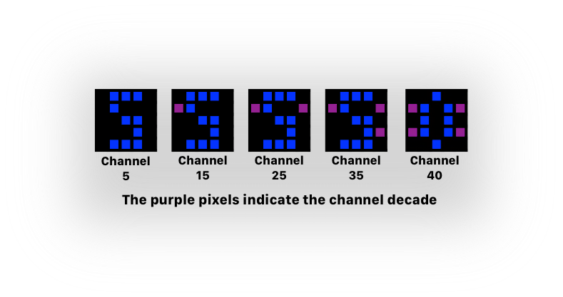
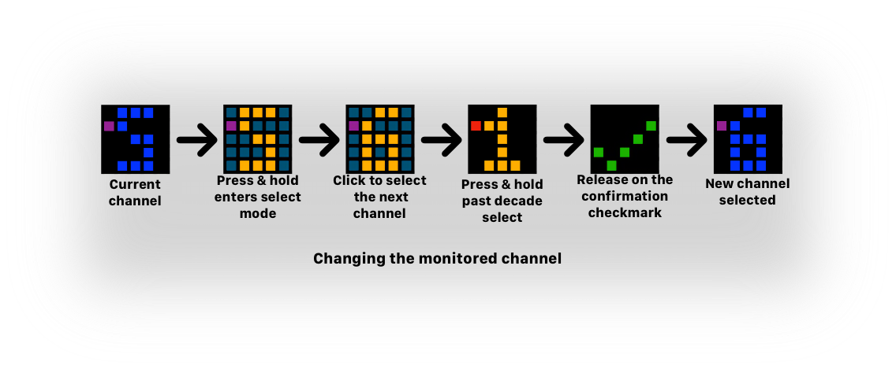
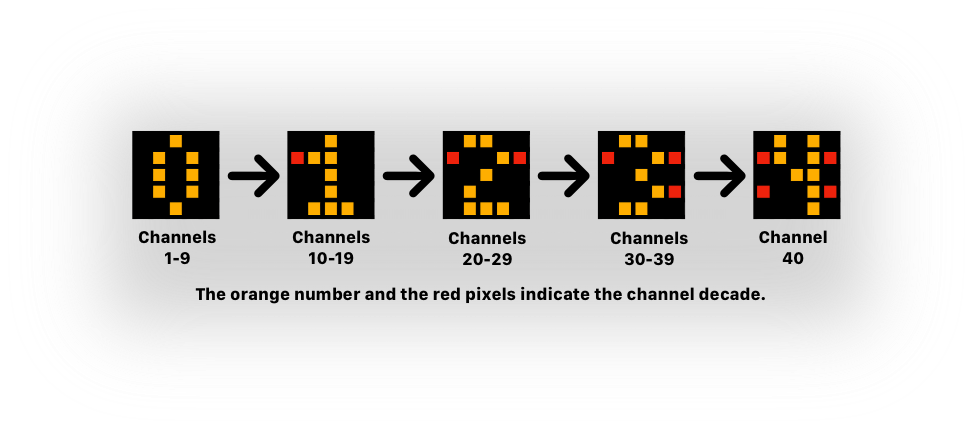

# Using STAC with ATEM Switchers

**Authors:** Team STAC

A guide to configuring and running STAC as a tally light for Blackmagic Design ATEM video switchers.


<a name="overview"></a>
## Overview

When configured for an ATEM switcher, STAC connects directly to the ATEM over your WiFi network and monitors the tally status of a single camera input. The tally display colours are identical to those used with Roland switchers:

| Display | Meaning |
|---------|---------|
| **RED** (solid) | Input is on-air (Program / PGM) |
| **GREEN** (solid) | Input is in preview (Preview / PVW) |
| **PURPLE DOTTED** | Input is neither on-air nor in preview (Camera Operator mode only) |
| **GREEN** (solid) | Input is not on-air (Talent mode) |

Refer to the STAC Users Guide for a full description of Camera Operator mode versus Talent mode.

---

<a name="network-topology"></a>
## Network Topology

<a name="how-stac-connects-to-an-atem"></a>
### How STAC Connects to an ATEM

Each STAC connects **directly** to the ATEM switcher over UDP on the same WiFi network. No intermediary device, relay server, or additional hardware is required.

The network arrangement is straightforward:

```
                    WiFi Router / Access Point
                           │
           ┌───────────────┼───────────────┐
           │               │               │
        STAC #1         STAC #2        STAC #3
     (Input 1)       (Input 2)      (Input 3)
           │               │               │
           └───────────────┴───────────────┘
                           │
                     ATEM Switcher
                     (UDP port 9910)
```

All devices — the ATEM switcher and all STACs — must be on the same WiFi network. The STAC connects to the ATEM using the ATEM's IP address, which you supply during setup.

The ATEM pushes tally state updates to connected clients. Unlike Roland switchers (which STAC polls on a fixed interval), the ATEM connection is persistent and event-driven — the STAC receives updates as soon as the ATEM sends them.

<a name="compared-to-other-atem-tally-solutions"></a>
### Compared to Other ATEM Tally Solutions

Some other ESP-based ATEM tally solutions (such as AronHetLam's ESP8266 tally light, whose ATEM library STAC uses) include a **relay / tally server** topology. In that arrangement, one device connects to the ATEM and re-broadcasts tally data to additional tally units over a separate protocol. This bypasses the ATEM's simultaneous client limit.

```
 AronHetLam relay topology (not used by STAC):

     ATEM ──── Tally Server ──── Tally Client #1
                             └── Tally Client #2
                             └── Tally Client #3
```

**STAC does not use this relay architecture.** Every STAC connects directly to the ATEM. This is simpler to set up and requires no additional infrastructure, but it does mean each STAC consumes one of the ATEM's limited client slots. See [Connection Limitations](#connection-limitations) below.

---

<a name="connection-limitations"></a>
## Connection Limitations

ATEM switchers allow a fixed number of simultaneous UDP client connections. Each STAC configured for ATEM uses one slot.

| ATEM Model | Simultaneous Client Limit |
|------------|--------------------------|
| ATEM Mini, Mini ISO | 5 |
| ATEM Mini Pro, Mini Pro ISO, Mini Extreme | 5 |
| ATEM Television Studio HD | 5 |
| ATEM Television Studio HD8, HD8 ISO | 5 |
| ATEM 1 M/E Production Studio 4K | 5 |
| ATEM 2 M/E Production Studio 4K | 5 |

In practice, the limit across all ATEM models that support tally-by-index is **5 simultaneous clients**. Some higher-end models may allow up to 8, but 5 is the safe assumption.

**What happens when all client slots are taken?** The ATEM will reject new connection requests. When a STAC detects that it has been rejected, it displays its error indication (see [Troubleshooting](#troubleshooting)) and will keep retrying. If a slot becomes free — for example, another client disconnects — the STAC will reconnect automatically.

**Practical guidance:**
- For up to 5 cameras, configure a STAC per camera and connect each directly to the ATEM.
- At a camera position where both the camera operator and on-stage talent need a tally indicator, consider using Peripheral Mode (see below). One STAC connects to the ATEM and shares tally data with a second STAC via the GROVE cable. Both units show the same tally state, but only one ATEM client slot is consumed. The total number of independent camera positions you can monitor does not increase beyond the ATEM's client limit.

---

<a name="first-time-setup"></a>
## First Time Setup

Setup for ATEM follows the same web portal process as for Roland switchers. You will need:

* The SSID and password of the WiFi network your ATEM switcher is connected to
* The IP address of the ATEM switcher
* The ATEM input number you want this STAC to monitor (1–40)

You will also need a device with a web browser to connect to the STAC hotspot during setup.

> **Finding the ATEM IP address:** In ATEM Software Control, go to **Preferences → Switcher** (or check your router's DHCP client list). The ATEM must have a stable IP address — assign it a static IP in your router if needed.

1. Power up the STAC. It will flash the red setup-required icon and begin pulsing, waiting for configuration.

2. On your phone, tablet, or computer, open WiFi settings and connect to the STAC hotspot. The SSID will be something like **STAC-4660A124**. The WiFi password is **1234567890**.

3. Open a browser and navigate to `http://stac.local`.

4. On the **Setup** tab, tap the model dropdown and select **ATEM (Blackmagic Design)**, then tap **Next**.

5. Fill in the form:
   - **Network Name (SSID):** Your WiFi network name (the one your ATEM is on)
   - **Password:** Your WiFi password
   - **ATEM Switcher IP Address:** The IP address of the ATEM (e.g., `192.168.1.100`)
   - **Input Number:** The camera input number on the ATEM to monitor (1–40). This can be changed on the device later.

6. Tap **Configure STAC**.

The STAC will confirm receipt, briefly show a checkmark on its display, then restart and begin operating.

> **Note:** There is no port number and no polling interval for ATEM. The ATEM uses UDP port 9910, which is handled automatically. Leave the IP address in its proper dotted-decimal format — the form will warn you if it isn't valid.

---

<a name="up-and-running"></a>
## Up and Running

<a name="what-the-stac-shows-during-normal-operation"></a>
### What the STAC Shows During Normal Operation

On power-up, after the brief orange and green startup indicators, the STAC shows the active tally input number in blue on a black background.

<a name="channel-display"></a>
### Channel Display

With LCD displays, the active channel number is shown. With LED matrix displays, the last digit of the chanel is shown along with a purple indicator to show which decade that number belongs to. Refering to the picture below, no dot means the number is the actual channel. One dot means "add 10 to the number"; two dots mean add 20; three add 30. Since the highest channel is 40, that is indicated by 0 and 4 dots.


<!-- comment
This is distinct from Roland switchers (which show blue for HDMI / V-60HD channels and light green for SDI channels) — the blue colour indicates an ATEM configuration at a glance.
 -->

<a name="startup"></a>
### Startup
From here, the startup parameter sequence and button operation are identical to what is described in the STAC Users Guide:

1. Click through (or press-and-hold to change): **Tally Input Number**
2. Click through (or press-and-hold to change): **Tally Display Mode** (C or T, purple)
3. Click through (or press-and-hold to change): **Startup Mode** (S or A, teal)
4. Click through (or press-and-hold to change): **Brightness Level**
5. Final click starts the WiFi connection sequence and normal monitoring.

Once connected to WiFi, the STAC connects to the ATEM. During the ATEM connection and initialization phase (which can take a few seconds on startup), the orange WiFi-connected state may remain briefly before the first tally state is received.

<a name="setting-the-tally-input-on-device"></a>
### Setting the Tally Input (On-Device)

ATEM inputs go from 1 to 40. The STAC provides a two-tier selection mode to navigate the full range quickly without cycling through all 40 values one press at a time.

**Entering select mode:**

1. While the blue input number is shown, **press and hold** (~1.5 s). The display changes to an **orange number on a dark teal background** — you are now in **Ones cycling mode**.

**Ones cycling mode** (orange on dark teal):

- **Click** to advance to the next input (+1 each press). Cycles 1 → 2 → … → 40 → 1.
- On LED matrix boards, **purple** corner pixels show which bank (decade) you are in.
- **Hold ~1.5 s** to switch to Bank cycling mode.
- **Hold ~3 s** to confirm the current value and exit.



**Bank cycling mode** (orange on black):

- The display shows the **tens digit** (0–4) of the selected bank, with **red** corner indicators matching the bank number. This mode is useful for jumping quickly from bank 1 (1–9) to bank 2 (10–19), bank 3 (20–29), and so on.
- **Click** to advance to the next bank start: 1 → 10 → 20 → 30 → 40 → 1.
- **Hold ~1.5 s** to return to Ones cycling mode at the current bank position.
- **Hold ~3 s** to confirm the current bank start and exit.



**Timeouts and cancellation:** If no button activity is detected for ~30 seconds while in either mode, the change is cancelled and the original input number is restored.

**Example — setting input 23:**

1. Hold → enter Ones cycling mode. The display shows your last saved input in orange.
2. Hold → enter Bank cycling mode. Display shows tens digit `0` (bank 1–9).
3. Press twice → bank advances to `1` (bank 10–19), then `2` (bank 20–29). TL and TL+TR corner pixels light in red.
4. Hold → return to Ones cycling mode at input 20.
5. Press three times → 21 → 22 → **23**.
6. Hold ~3 s → confirmed. Green checkmark briefly shown.

<a name="setting-the-tally-display-mode"></a>
### Setting the Tally Display Mode

Identical to Roland switchers. See the "Setting the Tally Display Mode" section in the STAC Users Guide. The display, button interaction, and timeout behaviour are the same.

<a name="setting-the-startup-mode"></a>
### Setting the Startup Mode

Identical to Roland switchers. See the "Setting the Startup Mode" section in the STAC Users Guide.

<a name="setting-the-brightness-level"></a>
### Setting the Brightness Level

Identical to Roland switchers, including the ability to change brightness while actively monitoring. See the "Setting the Brightness Level" section in the STAC Users Guide.

<a name="setting-the-display-orientation"></a>
### Setting the Display Orientation

Setting the display Orientation is supported on devices with the appropriate hardware (an IMU). Press the Reset button to restart and re-detect orientation. See the "Setting the Display Orientation" section in the STAC Users Guide.

---

<a name="peripheral-mode"></a>
## Peripheral Mode

For devices that support it, Peripheral Mode works with ATEM exactly as it does with Roland switchers. One STAC maintains the WiFi connection and ATEM subscription; a second STAC connected via the peripheral port receives tally data from the first.

This is useful at a camera position where both the operator and the on-stage talent need a tally indicator. Only the controller STAC uses one ATEM client slot; the peripheral STAC requires no WiFi connection and no ATEM slot.

Refer to the "Peripheral Mode" section in the STAC Users Guide for setup instructions. The hardware connection and button sequence are identical regardless of switch type.

---

<a name="troubleshooting"></a>
## Troubleshooting

**Orange WiFi indicator stays on after connecting**  
The STAC is still attempting to connect to the ATEM. The ATEM connection can take a few seconds after WiFi is established. If the orange indicator persists for more than ~10 seconds, check that the ATEM IP address entered during setup is correct and that the ATEM is powered on and reachable.

**Red X or error display appears after a teal screen**  
The STAC connected to the ATEM but then lost the connection, or the ATEM rejected the connection. Check that the ATEM is still on and reachable. If you have five or more other ATEM clients active, a slot may not be available — disconnect one of the other clients. The STAC will retry automatically.

**All connection slots are full — STAC keeps retrying**  
The ATEM has reached its client limit (typically 5). Either disconnect another ATEM client or use Peripheral Mode to share one ATEM connection between two STACs at the same camera position.

**Tally colours are correct but the wrong input is being monitored**  
Verify the configured input number in the web portal or by stepping through the startup sequence. Remember that for inputs 10–40, the display shows only the ones digit — it is possible to select the wrong input if not counted carefully from a known reference point.

**Tally colour doesn't change when switching**  
This can happen if the STAC lost its ATEM connection silently and is still showing the last known tally state. Press the Reset button on the side of the STAC to restart and reconnect.


<!-- EOF -->

