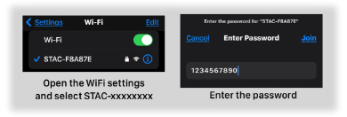
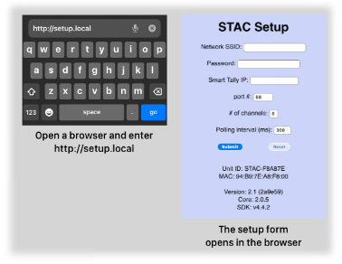
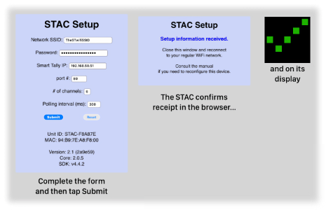
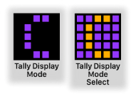
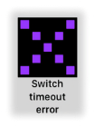

# STAC Users Guide
## (Smart Tally ATOM Client)
 
**Authors:** Team STAC
 

**A Roland Smart Tally Client**

Take a bit of custom software, pour it into an [M5Stack ATOM Matrix](https://docs.m5stack.com/#/en/core/atom_matrix) board, give it a shake and&mdash;ta da! It becomes a *Smart Tally Atom Client* or **STAC** for short.

Its purpose and sole joy in life is to monitor the tally status of a single video input channel of a Roland video device that implements their Smart Tally protocol and indicate to you that status via the display of the ATOM.

The STAC uses WiFi to connect to the same network as that of the Roland switch. It continually polls the switch for the tally status of the video channel being monitored. For that channel, the STAC will set the colour of its display:

* When in "Camera Operator" mode, to:
	- RED if the channel is in PGM (Program or onair)
	- GREEN if the channel is in PVW (Preview or selected)
	- "PURPLE DOTTED" if the channel is not in either PGM or PVW (unselected)

* When in "Talent" mode, to:  
	- RED if the channel is in PGM (Program or onair)
	- GREEN otherwise

There is also a Peripheral Mode that allows a STAC to be connected to another via their GROVE ports. The STAC configured in Peripheral Mode receives its data from the other STAC without the need to establish a WiFi connection to the Roland switch.

Setup of the STAC for the WiFi credentials, Roland switch IP address, port number, number of tally channels and polling interval is done using a web browser.

Other parameters are set using the display button, with feedback provided via the display.

To ensure you see the pictures, make sure the `images` folder is in the same folder as this *STAC Users Manual.md* file.  

**Contents**

  - [Getting to Know You](#getting-to-know-you)
  - [Quick Start](#quick-start)
  - [First Time Setup](#first-time-setup)
  - [Up and Running](#up-and-running)
    - [Setting the Tally Channel](#setting-the-tally-channel)
    - [Setting the Tally Display Mode](#setting-the-tally-display-mode)
    - [Setting the Startup Mode](#setting-the-startup-mode)
    - [Setting the Brightness Level](#setting-the-brightness-level)
    - [Setting the Display Orientation](#setting-the-display-orientation)
  - [Redoing the Setup](#redoing-the-setup)
  - [Peripheral Mode](#peripheral-mode)
    - [Operation](#operation)
    - [Disabling Peripheral Mode](#disabling-peripheral-mode)
    - [Notes](#notes)
  - [Factory Reset](#factory-reset)
  - [Updating the Software](#updating-the-software)
  - [Back to the Beginning](#back-to-the-beginning)
  - [Special Configurations](#special-configurations)
  - [Troubleshooting](#troubleshooting)
    - [_The WiFi Connect Loop of Death_](#the-wifi-connect-loop-of-death)
    - [_Tally Status not Changing_](#tally-status-not-changing)
    - [_A Big Orange X?_](#a-big-orange-x)
    - [_A Big Purple X?_](#a-big-purple-x)
    - [_The Red WiFi Interrupt Screen!_](#the-red-wifi-interrupt-screen)
    - [_Purple Question Mark?_](#purple-question-mark)
    - [_The Big Red X_](#the-big-red-x)
  - [Acknowledgements](#acknowledgements)
  - [LICENSE](#license)
  - [Revision History](#revision-history)

  

## Getting to Know You

The bits you need to know about when using the STAC are shown in the picture below.

The Display is, well, just that. A square matrix of colour LED's used to show: the state of the tally channel being monitored; receive feedback on its operation; and for setup. We'll get to those parts in a while.

The Display is also a button that you'll click and press to select and set various operating parameters for the STAC.

The Reset Button is used in conjunction with the Display button to reconfigure, clear, and update the STAC. It can also be used to restart the STAC.

The USB port is used to power the STAC. Use one end of a standard USB-C cable to connect here and the other end to whatever matches the power supply being used. FWIW, data is not required, only 5 VDC power. There is no power switch on the STAC so once the cable is connected to a power supply it comes to life and is good to go. The power can be disconnected at any time without concern for the state of the STAC.

The GROVE connector is used when the STAC is operated in Peripheral Mode. Connecting a cable between two STACs allows the peripheral STAC to be powered by, and receive tally status information from, another STAC. There's a [section](#peripheral-mode) on this later.

On the back of the STAC is a dang tiny 2mm machine screw hole that can be used to attach the STAC to whatever you would like.

Note the ventilation holes on the sides of the STAC. To allow for cooling, these should not be blocked. The display LED's can get a bit toasty, especially when operating at higher brightness levels.

  
 
## Quick Start

We'll get to the initial setup (and how to change it) later. Here we'll show the normal operating sequence for using the STAC.

Connect one end of a USB-C cable to the STAC and the other to a 5 VDC power source.

The STAC will briefly show a "power on" indicator and then display the tally channel of the Roland Smart Tally device it is monitoring. This is the active channel.

From here, click the Display Button. The Tally Display Mode of the STAC is shown. Click again. The Startup mode of the STAC is shown. Click once more and the current Brightness Level of the display is shown.

The active tally channel, tally display mode, startup mode, and the display brightness can each be changed when they are shown during startup. The display brightness level can also be changed when the STAC is actively monitoring the tally channel. We're getting to that part too.

When the Brightness Level is displayed, the next click of the display button (we'll just call this the button from here on), will let the STAC loose to do its magic.

The orange "attempting to connect to WiFi" icon is shown and, after a bit if the connection is made, the icon will change to green, indicating success.  

Once WiFi is connected the STAC will start querying the configured Roland Smart Tally device for the tally status of the channel being monitored. The STAC then continually polls the Roland switch and the display will change according to the tally status returned by the Roland device like so...

We're going to call this the normal operating state of the STAC.

**Note:**

* if the STAC Tally Display Mode is set to Talent, only the Program and Preview states will be shown.
* if you're seeing the four corners blinking green off and on, the STAC Autostart mode is active. We'll cover that [below](#setting-the-startup-mode).

So that's the general flow of things. Now let's get to the nitty gritty...
  

## First Time Setup

Until you tell it a few things, the STAC is pretty useless. You'll have to set it up.

To do this you need the:

* SSID and;
* Password of the WiFi network to which your Roland switch is connected;
* IP address of the Roland switch;
* the port number used by the Roland switch;
* maximum tally channel number of the Roland switch.

You'll also need a computer, phone, tablet, or some other device that can connect to a WiFi network and run a web browser as that is the tool you'll use to send the setup information to the STAC. Here's how...

1. Power up the STAC. It will flash the red "setup required" icon and then hold this icon on the display. The STAC then fires up a WiFi hotspot so it can communicate with your web browser and waits for the setup information to be received.

  

2. Using a computer, phone, tablet, or some other smarty pants device, open its WiFi settings and pick the SSID of your STAC. The STAC SSID starts with "**STAC-**" followed by eight characters. Something like "**STAC-4660A124**".   Each STAC has its own unique SSID. 

 

3. Join the STAC WiFi network and when prompted, enter the STAC WiFi password which is **1234567890**. 

4. Once connected&mdash;on your smart device: fire up a web browser; open a new browser window and go the STAC setup page at `http://setup.local`.

5. In the browser, fill in the form with the: WiFi SSID and Password; the Roland device Smart Tally IP address; its port number; and the maximum channel number that you want to monitor. Remember, the Roland device must be on the WiFi network that matches this SSID and Password.  The Polling interval default is OK for most uses.

6. Once the information has been entered, tap the "Submit" button to send the form to the STAC.
The STAC will: send a confirmation page to your browser; briefly show a confirmation checkmark on the display; and then shut down its WiFi hotspot.  

  

7. Close the confirmation window in your browser, reconnect your smart device to your preferred WiFi network and you're done. Like dinner.

After the configuration information is submitted and the STAC confirms receipt, the STAC will start up as described in the [Quick Start](#quick-start) section above. Unless it doesn't, in which case, pop down to the [Troubleshooting](#troubleshooting) section and it'll tell you how to fix that up. And since you're wondering yup&mdash;you sure can redo the setup. Nothing is forever. There's a how-to [below](#redoing-the-setup).

But first, a few things about entering the setup information in your browser:

* The SSID, Roland IP address, port number and maximum tally channel number are required. The form cannot be submitted with these fields blank.
* The maximum SSID length is 32 characters
* The password can be left empty to allow for open WiFi networks. The password is limited to 63 characters.
* The Roland IP address must be in proper IP address format before the form can be submitted.
* The maximum tally channel number is set to **6** by default. The highest number that can be entered is **8**. The smallest is **1**.
* The port number is set to a default of **80**. It should only be changed in special situations like described in [Special Configurations](#special-configurations) below.
* The Polling interval is the amount of time the STAC will wait between sending tally channel status requests to the Roland device. Default is **300** ms. Minimum is 175 ms and the maximum is 2000 ms. Though the value can be set in 1 ms increments, the practical "chunk" is increments of 50 ms. 

Regarding the SSID and Password, be cautious when entering quotes as most devices will by default convert these to "smart quotes" which, as per WiFi standards are not allowed.

If the Submit button is tapped and there is missing or incorrect information entered on the form, a little bubble will pop up by that field prompting you to complete or correct the information.

The SSID and Password fields stop accepting input after their limits are reached.

Taping the "Reset" button on the browser form will clear all information entered and set the port number, number of channels and the polling interval to their defaults, leaving the form open.

At the bottom of the form some info about the STAC is shown as a bit of trivia.

Unit ID is the unique identifier for this STAC. It is SSID of the STAC when being configured and the label you'd see in the WiFi router client table for this STAC when it is operating.

MAC is the network interface MAC address. Skip ahead a couple of paragraphs for why you might need that.

Version is the version number of the STAC software. The characters in brackets are the "build number" of this version.

Core is the arduino-esp32 core version used by the STAC software version.

SDK is the espressif ESP-IDF software development kit version used by the arduino-esp32 core.

If you're having trouble connecting to the STAC using `http://setup.local`, it may be because the `http:` bit wasn't entered and so the browser is trying to go use an `https:` connection. If checking that doesn't work, you can always connect by pointing the browser to the IP address of the STAC which is `192.168.6.14`.

Totally geeky stuff but that's where it is if we ask for it if you contact us with a question.

One last point regarding the WiFi network. Configuring the STAC with a static IP address is not supported. Therefore, when the STAC negotiates a connection to the specified network, the network must supply an IP address via DHCP. If a static STAC IP address is desired, the STAC MAC can be used to assign the IP from the router. The MAC address of the STAC can be found:

* via the WiFi router client table after the STAC has an address assigned from the DHCP pool;
* on the web configuration form;
* from the STAC startup serial data information dump (refer to the *Using screen for STAC Information* document).

Egads. That was a lot of jargon. Find a friend that knows networks if you need a hand with this.

**Some advice:** If you are configuring multiple STACs in one go, it is quite important to close the Confirmation browser window each time before moving onto the next one. Using a desktop or laptop computer and browser is recommend. Some browsers, notably the mobile variety, get hung up when connecting to the `setup.local` or IP address of the STAC (as each one is the same) even though the STAC and its WiFi SSID are unique.
  

 
## Up and Running

OK, you got the STAC set up, it's connected to the WiFi network (of the Roland device) and you're looking to set it to monitor a tally channel, etc. Perfect! Let's get into that...

Once set up and connected to the WiFi network, you can tell the STAC:

* which smart tally channel to monitor;
* to set the tally display to "Camera Operator" or "Talent" mode;
* which startup mode to use;
* to change the brightness level of its display.

We call these the operating parameters, or parameters for short.

To change an operating parameter you use the display button. When a parameter is displayed during startup, a single click of the display button will confirm the setting of that parameter and advance to the next one. The parameter sequence is: 

* Active Tally Channel &#8594; 
* Tally Display Mode &#8594; 
* Startup Mode &#8594; 
* Brightness Level

Clicking past the Brightness Level display starts the STAC WiFi connect sequence and then on to monitor the active tally channel.

To change the value of a parameter, you press and hold the display button while that parameter is being displayed. After about two seconds, the STAC will move into "select state". The display will change to reflect that state and to let you know you're now able to change that parameter. 

Once the STAC is in a select state, release the button. Subsequent clicks of the button will advance to the next value of the parameter, looping back to the start when the end value of that parameter is reached.

Once the desired value for that parameter is shown on the display, press and hold the button again for about two seconds. The STAC will briefly display a green checkmark to confirm the change, exit select state and display the new value of the parameter in its normal (non-select state) colours.

From here, a button click will move to the next parameter that can be changed. Or if you press and hold the button, you'll once again enter the select state for that parameter. Wash, rinse, repeat.

That was a lot of words. Let's show you how this works in detail for changing the tally channel. You can then apply the same method for the other parameters...

### Setting the Tally Channel

Power up your STAC. When you see the blue active tally number on the display, press and hold down the button. In about two seconds the display will change from a blue number on black background to an orange number on a blue background. The orange colour is a bit of a heads up to let you know the STAC is in a select state and you can now change or select the value. We use this convention with all the parameters when in a select state.  

Now click the button once. The tally number will advance by one. Keep clicking the button and watch how the tally number increases and then wraps around to the number **1**. Keep clicking until the desired tally channel is shown. Or until your finger gets tired. Your call.  

Now press and hold the button. After about two seconds the green "confirmed" checkmark will briefly appear, the STAC will exit select state and the display will show the new active tally channel as a blue number on a black background. Release the button.

Only easy right?

When in a select state, the STAC has a timeout feature. If after entering a select state, no clicks or presses of the button are detected for about 30 seconds, the select state is cancelled and the display and tally channel will revert back to the value it had before entering select state. From here the button can be clicked to advance to the next parameter or press and hold it to enter the select state again.

Point to note. The maximum tally channel number is set when the STAC is set up via the web browser. If that maximum is set to **1**, you can enter the tally channel select state but clicking the button thereafter will have no effect as the lowest and highest numbers are the same. So if the tally number is not changing past **1**, and you need to select a higher number, you'll need to redo the setup of the STAC. No biggie, check out how to do that [below](#redoing-the-setup).

The STAC setup does not require that the maximum tally channel be the same as all the channels of the Roland device that support the Smart Tally protocol. For example, the Roland V-60HD supports up to six Smart Tally channels. However if you only have sources connected to the first four video input channels, you could configure the maximum tally channel on the STAC to be **4**. Then during setup, after selecting channel four, the STAC would wrap back around to channel **1**.

While we're talking setups, if your STAC is set to monitor, say channel **6**, and you redo the setup with the maximum tally channel set to a number less than that, after sending the new setup information to the STAC the active tally channel will be reset to **1** as the STAC can't monitor a channel higher than the maximum you set it to. Make sense?

And, oh yeah, the STAC remembers the last set Tally Channel across power cycles. Convenient, yes?

### Setting the Tally Display Mode

Tally Display mode? Yup.

Folks on-stage (the "talent") really only need to know where the cameras are and which camera is currently live. For the person operating the camera it is also useful for them to know whether the channel is inactive (neither in program nor preview) and to be informed if there are any error conditions or operating issues with the STAC. To accommodate this, you can select the Tally Display Mode of the STAC to either "Camera Operator" or "Talent".

In Talent mode, the display shows red when the tally channel being monitored is live (a.k.a.: Active, Program, PGM, On Air) or green otherwise. Refer back to the picture [up there](#tallystates) in the [Quick Start](#quick-start) section.

In Camera Operator mode, the display is red when the channel is live, green when in Preview (a.k.a.: Inactive, Standby, PVW) and "dotted purple" when Unselected (neither in Program nor Preview). If the operation of the STAC becomes anything other than normal, the display changes to the alert the operator. More on that down in the [Troubleshooting](#troubleshooting) section.

The sequence of steps to change the Tally Display Mode is the same as for setting the tally channel so this section is abbreviated. Check out [Setting the Tally Channel](#setting-the-tally-chanel) above for the long-winded version.

The Tally Display Mode is shown as a purple letter on a black background. A **C** means the STAC is in **Camera Operator Mode**. A **T** is shown for **Talent Mode**.  

To change the Tally Display Mode:

1. When the purple **C** or **T** is shown, press and hold the button.
1. After about two seconds the display will change to an orange letter on a purple background.
1. Click the button to toggle between the two Tally Display Modes.
1. When the desired mode is shown on the display, press and hold the button.
1. After about two seconds the green confirmed checkmark will be shown briefly and the STAC will exit select mode. Release the button.
1. The new Tally Display Mode will be displayed as a purple letter on a black background.

You can press and hold again to change the Tally Display Mode or if you click the button, move on to displaying the next operating parameter.

When in a select state, the STAC has a timeout feature. If after entering the select state, no clicks of the display button are detected for about 30 seconds, the select state is cancelled and the display and Tally Display Mode will revert back to the value it had before entering the select state. From here the button can be clicked to advance to the next parameter or press and hold it to enter the select state again.

**Note:** When the STAC is in Talent Mode, the WiFi connect icons show only on power up or when the STAC is reset. If WiFi is lost after having a WiFi connection, the display will switch to the Preview (green) state until WiFi is reestablished. Once connected, normal display operation will resume. In Camera Operator Mode, the WiFi connect information is always shown.

The STAC also remembers the last set Tally Display Mode across power cycles. Genius.
  

 
### Setting the Startup Mode

Normally when the STAC starts up or is reset you have to "click through" the operating parameters to start the WiFi connect sequence for the STAC to begin to monitor the active channel. If you rarely change those parameters or if the STAC is installed in a place that is tricky to access, the STAC can be set to automatically jump to the WiFi connect sequence without the need to "click through".

This is the Startup Mode and it can be set to "Standard" or "Autostart".

In Standard mode you have to click through each operating parameter as described in [Quick Start](#quick-start), changing whichever one you would like along the way.

When starting in Autostart mode the STAC will show the active tally channel and blink the corners off and on in green to let you know autostart is active. The STAC will wait like this for about 15 seconds. If the button is not pressed during this time, autostart kicks in and the STAC will jump right to the WiFi connect sequence. If the connection is made, the STAC then starts to monitor the active tally channel.

When started or reset in autostart mode, the STAC responds to button presses just like in standard startup mode. When the active tally channel is shown and the corners are blinking green, a click of the button will advance to show the current Tally Display Mode, and so forth. Pressing and holding the button will enter into the tally channel select state.

A press or click of the button cancels autostart and you'll then have to click through the operating parameters to start the WiFi connect and tally channel monitoring. However autostart mode is still active on the next startup or reset.

The sequence of steps to change the Startup Mode is the same as for setting the tally channel so this section is short. Check out [Setting the Tally Channel](#setting-the-tally-channel) above for the long-winded version.

The Startup Mode is displayed as a teal letter on a black background. An **S** means the STAC is in **Standard Startup Mode**. An **A** is shown for **Autostart Mode**.  

To change the Startup Mode:

1. When the teal **S** or **A** is shown, press and hold the button.
1. After about two seconds the display will change to an orange letter on a teal background.
1. Click the button to toggle between the two Startup Modes.
1. When the desired mode is shown on the display, press and hold the button.
1. After about two seconds the green confirmed checkmark will be shown briefly and the STAC will exit select state. Release the button.
1. The new Startup mode will be displayed as a teal letter on a black background.

You can press and hold again to change the Startup Mode or if you click the button, move on to displaying the next operating parameter.

When in a select state, the STAC has a timeout feature. If after entering the select state, no clicks or presses of the button are detected for about 30 seconds, the select state is cancelled and the display and Startup Mode will revert back to the value it had before entering the select state. From here the button can be clicked to advance to the next parameter or press and hold it to enter the select state again.

The STAC also remembers the last set Startup Mode across power cycles. It's a wondrous thing.

 
### Setting the Brightness Level

To accommodate a range of ambient light levels when using the STAC, the brightness of the display can be changed. As with changing the active tally channel, the method is the same so this section is abbreviated. Check out [Setting the Tally Channel](#setting-the-tally-channel) above for the extended directors cut.

The current brightness level is shown as a white number on a spectacular field of red and green dots. Yes, it looks like Christmas. There are six brightness levels, increasing from **1** (lowest) to **6** (brightest). Bet you didn't see that coming. Anyway, as levels are selected, the display brightness changes to match.

To change the Brightness Level:

1. When the current Brightness Level number is shown shown, press and hold the button.
1. After about two seconds the display will change to an orange number with a white stripe on either side.
1. Click the button to increase the Brightness Level.
1. At Brightness Level 6, the next click will wrap around to Brightness Level 1. You can keep clicking to find the ideal photon bombardment.
1. At the desired Brightness Level, press and hold the button.
1. After about two seconds the green confirmed checkmark will be shown briefly and the STAC will exit the select state. Release the button.
1. The new Brightness Level is set.

You can press and hold again to change the Brightness Level or if you click the button, the STAC will start the WiFi connection sequence.

When in a select state, the STAC has a timeout feature. If after entering the select state, no clicks of the display button are detected for about 30 seconds, select state is cancelled and the display and Brightness Level will revert back to the value it had before entering the select state. From here the button can be clicked to advance to the WiFi connect sequence or press and hold it to enter the select state again.

Here's the bonus feature. *The Brightness Level can be changed while the STAC is monitoring the active tally channel!* Works in either Camera Operator or Talent mode. Mind blowing I know. The method is the same as described here. Just press and hold the display button. The STAC will flip into the Brightness Level select state. Set the level as you'd like, then press and hold the button. The confirmation checkmark will be briefly shown. Release the button and the STAC will return to monitoring the tally channel. Whoa! And yes, the timeout feature is active here as well.  

The STAC engages its elephant brain to remember the last set Brightness Level across power cycles. One and done!

  
### Setting the Display Orientation

As the world turns, it may not always be convenient to mount the STAC with the USB port at the bottom. It'd be nice if the display was always an upright citizen. Well, we got you covered there too.

On startup, the STAC determines which way is up and will rotate the display so that things are always shown right side to. If the STAC is started laying on a flat surface, the USB port is considered down and that will be the baseline for the display.

To change the display orientation, mount or hold the STAC as it will be in use and then click the Reset button on the side. The STAC will restart and set the display orientation appropriately. Is that cool or what!

The STAC does this check on every power up or restart. Orientation from the last power up or restart is not retained. 

## Redoing the Setup

At some point, probably, one or more of the WiFi SSID, Password or Roland device IP address will change. Or maybe you want to take your STAC on the road. Who doesn't like a road trip? In this case you'll want to set up the STAC to match the new settings. We got you covered.

To change the setup you'll use the Reset button and Display button in combination. If this is your first setup redo rodeo, best to read though the rest of this section and then come back here. It's OK. We'll wait...

1. Power up the STAC. It will pause at the tally channel display.
1. Press and hold down the Reset button on the side of the STAC.
1. While continuing to hold down the Reset button, press and hold down the Display button.
1. While still holding down the Display button, release the Reset button. (Insert gratuitous Kraken reference.)
1. Release the Display button when the orange setup icon starts flashing on the display.

If you did this little dance right, (guess you figured it'll take two hands) the orange setup icon will stay on after flashing. The STAC is now waiting patiently for the new information to head its way.

If the STAC returns to the tally display, just give the two-button dance another whirl. You got this.

From here follow the directions under [First Time Setup](#first-time-setup) above; connecting to the STAC by WiFi and using a browser to bring up the Setup form and so on.

If you mysteriously entered this setup state by accident or you change your mind at this point, click the Reset button and the STAC will return to its normal startup sequence.

That's all there is to it.

 
## Peripheral Mode

Often on video camera rigs, two STACs are used. One facing the camera operator and one facing the stage talent. Since the units act as an operator-talent pair, Peripheral Mode allows one STAC to receive its tally information from the other.
     
The one STAC becomes the tally controller and the second becomes a tally peripheral to the controller. This reduces the traffic on the WiFi network and simplifies power cabling at the camera.

**To place a STAC into Peripheral Mode:**

You will need two STAC's. Each STAC must be running software version 1.10 or later. Peripheral Mode is not supported in earlier versions.

First, remove all power from each STAC.

For the STAC you want to operate in Peripheral Mode: 

1. Insert a jumper wire between the holes marked as G22 and G33 on the ATOM rear header block. When identifying the holes, note that the label on the back of the ATOM is offset. Refer to the picture below for correct placement of the jumper. 
1. Connect the two STACs with a 4-pin GROVE cable.
1. Connect one end of a USB-C cable to one of the STACs (either one will do) and the other end of the USB-C cable to a 5VDC power supply.

⚠️ <b>WARNING</b> ⚠️

<b>Before connecting the GROVE cable, make sure that both STACs are not set to their normal operating state.

Power up and confirm the Peripheral Mode STAC is in Peripheral Mode as described below before connecting the GROVE cable.</b>

<b>Double check that the jumper is connected <i>exactly</i> as shown in the picture.  Incorrect placement of the jumper wire can cause permanent damage to the STAC!</b>

 

Only one of the STACs should be powered via its USB-C port. The other STAC is powered through the GROVE cable.

⚠️ **Do not** connect a USB cable to both STACs when the GROVE cable is connected. Galaxies will collide and other bad things will occur.

Install a jumper in only one of the two STACs. It wouldn't make sense to have two STACs in Peripheral Mode trying to talk to each other.

The jumper should be a piece of insulated 22 AWG (0.65 mm ø) solid copper wire like the kind used for electronic circuit breadboarding. The exposed ends inserted into the holes should be no longer than 5mm (~3/16"). Don't force it. And please, *don't* use a paper clip! Clippy is not your friend.

### Operation

On power up or restart, a STAC in Peripheral Mode will flash a green "P" on an orange background a few times, then display a green confirmation checkmark and then start operating in Peripheral Mode.

All normal operation state and features of the STAC are disabled. The STAC will not connect to a WiFi network, nor poll the Roland switch and it will ignore the normal Tally Channel, Tally Display Mode and Startup Mode settings. All tally information is received from the other (controller) STAC via the GROVE cable.

When in Talent mode, the display will be just as described [above](#setting-the-tally-display-mode). It will show red if the video channel being monitored by the controller STAC is in Program or onair and it will be green otherwise.

If set to Camera Operator, the display is as described [above](#setting-the-tally-display-mode) except that any state other than program, preview or unselected is shown as an orange X.

The display Brightness Level select feature is here too.

Setting brightness and tally display mode are a bit different when in Peripheral Mode. But not so much that it's a biggie. Either can be set any time after the green Peripheral Mode confirmation checkmark is shown.

### Setting the Brightness Level
1. Press and hold the button. In about two seconds, the STAC moves to its Brightness Level select state with the current brightness level displayed just as described [above](#setting-the-brightness-level).
1. Release the button.
1. Now you can click the button to pick the new level.
1. Press and hold the button and the new level is confirmed by showing the green confirmation checkmark. Release the button and the STAC returns to monitor the tally status. 

### Setting the Tally Display Mode
Flipping between the two modes is done like so:

1. Press and hold the button. In about two seconds, the current Brightness Level will be displayed.
1. Keep holding the button down until the current Tally Display Mode is shown. The STAC will already be in select state. 
1. Release the button.
1. Click the button to toggle between Talent and Camera Operator.
1. Press and hold the button and the new tally display mode is confirmed by showing the green confirmation checkmark. Release the button and the STAC returns to monitor the tally status.

See the bits above on setting the [Brightness Level](#setting-the-brightness-level) and [Tally Display Mode](#setting-the-tally-display-mode) for all the deets.

### Disabling Peripheral Mode

To disable Peripheral Mode and return the STAC it to its normal operating state:

1. Remove power from the Peripheral Mode STAC.
1. Remove the GROVE cable connecting the STACs. ⚠️ **Do not** use the GROVE cable to power up two STAC's that are in their normal operating state.
1. Remove the jumper wire from the rear of the STAC.
1. Power up the STAC via its USB port.

### Notes
    
1. It is not required to set up the STAC before Peripheral Mode can be used.
1. If the STAC is running software version 2.1 or greater, the Tally Display Mode of the STAC can be set to either Camera Operator or Talent. Talent mode is the default. With software versions from 1.10 to 2.0, only Talent mode is available.
1. Peripheral Mode retains its own display brightness level and tally display mode settings independent of those for its normal operating state. The values are retained until changed (when in Peripheral Mode) or when a Factory Reset is performed&mdash;in which case the Peripheral Mode display brightness will be set to **1** and the tally display mode to Talent.
1. The orientation feature works in Peripheral Mode so the display will always be shown the right way up. Pop back up to [that section](#setting-the-display-orientation) to review.
1. It is recommended to place a piece of electrical tape over the jumper wire to secure it in place. Take care not to cover the ventilation holes on the side.
1. The cable needed to connect the two STACs is known as a GROVE cable, as popularized by [seeed Studio](https://wiki.seeedstudio.com/Grove_System/). More specifically, the cable is a female-female 4-pin HY series 2.0mm pitch.
    - Searching for a 4-pin GROVE cable should turn up a few sources.
    - Alternately, if searching for an HY-2.0 4-pin cable, make sure to purchase one with "standard" pinout where pin 1 is connected to pin 1, 2 to 2, 3 to 3 and 4 to 4.  **Some companies offer a "reversed" cable (pin 1 to pin 4, 2 to 3, 3 to 2, 4 to 1) which will irreparably damage the STAC if used**. So, like, don't use it. 
    - Either "buckled" or "unbuckled" connectors on the cable work. Buckled connectors have a latch that will lock the cable connectors to the STACs.

## Factory Reset

All righty then. Maybe you want to hand off your STAC to someone else or just for giggles restore the STAC to its "fresh-out-of-the-box" state. Doing this erases the SSID, Password, Roland Smart Tally IP address, port number, maximum tally channel number and polling interval from the STAC and sets the active tally channel, operating mode, brightness level and polling interval to their default values. The Normal Operating Mode defaults are: 

* Tally Channel 1
* Tally Display Mode set to Camera Operator 
* Standard Startup Mode
* Brightness Level 1
* Polling interval of 300 ms.

It also resets the Peripheral Mode settings to their defaults which are:

* Tally Display Mode set to Talent
* Brightness Level 1

To do a factory reset, you'll follow the same procedure as [Redoing the Setup](#redoing-the-setup) except, instead of releasing the Display button at step 5, keep holding down the display button after the setup icon stops flashing. In about two seconds, the display will start flashing the factory reset icon.

 Release the button. A moment later the STAC will be completely reset, the display will blink once to confirm and the factory reset icon will remain on the display.

You can now remove power if you'd like or, to put the STAC back into service, click the Reset button and then set things up like [First Time Configuration](#first-time-configuration) above.

If you want to use the STAC in Peripheral Mode, it is not required to set up the STAC first.

If the Peripheral Mode jumper is installed, you will need to remove it before a Factory Reset can be performed.

Once the factory reset starts, there is no turning back. Not a super big deal, just do the setup thing once more and you're good to go.

You cannot do a Factory Reset if the red [Configuration Required](#stac_config_reqd) icon is displayed as the STAC is already in its factory default state.

 
## Updating the Software

This is too cool. Starting with software version 2.1, the STAC software can be updated using pretty much any device that can connect to WiFi and run a web browser. This is called an "over the air" or OTA update. Mind blown. Again.

It'll take a few words to describe this, so hang in there, but it isn't really all that fussy.

OK. In the repository where you found all this stuff in the first place, inside the STAC folder is a folder called `bin`. Inside there is a file named something like "`STAC_2-1-a1b2c3.bin`". This file contains the STAC software. Our objective is to download that file to the STAC.

We do that by:

* Copying the "`STAC_2-1-a1b2c3.bin`" file to the device you'll use to talk to the STAC. Same type of device you used to do the setup.
* Putting the STAC into software update mode.
* Connecting your device to the STAC WiFi hotspot.
* Using the browser on your device to go to the STAC Updater page.
* Selecting the "`STAC_2-1-a1b2c3.bin`" file on your device.
* Sending that file over to the STAC.

All right. Let's get into the steps, each in all their incredible glory.

1. **Copy the file to your device** Actually, not a lot to say here. If you're using a computer computer, it should already be there if you downloaded the STAC repository. If you're using a mobile device, "it's an exercise left to the reader" to determine how to copy the file to your device. Too many permutations to cover here.

2. **Put the STAC into Software Update Mode** Remember that two finger dance we covered back in [Redoing the Setup](#redoing-the-setup)? We're going to do the same thing to get the STAC set for a software update.  Follow the same procedure as [Redoing the Setup](#redoing-the-setup) except, instead of releasing the display button at step 5, keep holding down the button after the [setup icon](#stac_config_change) stops flashing. In about two seconds, the display will start flashing the [factory reset icon](#cleanslate). Keep holding down the button. About two seconds after the factory reset icon stops flashing, the software update icon will start to flash. 

 Release the button. The software update icon remains on the display. 

Yup it's weird looking. Only so much you can do with 5 by 5 pixels. It's supposed to indicate you can download something to the box. We try.

 
3. **Connect to the STAC WiFi** The STAC has now fired up a hotspot. Just like when you [set up](#first-time-setup) the STAC, open the device's WiFi settings and pick the SSID of your STAC. It starts with **"STAC-"** followed by eight characters. Something like **STAC-4660A124**. Each STAC has its own unique SSID.  If prompted, enter the STAC WiFi password which is **1234567890**.

4. **Go to the Updater page** Now, on your device, fire up a browser and go to `http://update.local`. The STAC will send over the update form like pictured below. 

 Tap the `Choose file` button and navigate to the location where you saved the "`STAC_2-1-a1b2c3.bin`" file and select that. The page in your browser should show the file name. The `Update` button is now active too.

5. **Update the Software** Tap the `Update` button. The progress bar in the browser should start to move. In about ten or so seconds, the browser page will refresh to let you know the status of the update. The STAC display will briefly show a green checkmark or a red X depending if the update succeeded or failed. 

 After updating its software the STAC will shut down its hotspot and then reset itself, returning to it's normal startup sequence fresh as a daisy with new clean software.

That's it. Super easy indeed!

### Other things to know

Here are a few points worth noting when doing a software update.

1. After a software update, the STAC will try and use the setup information it had before the update. However, depending on the nature of the update, it may be necessary to reset this information. If that is the case, when the STAC restarts, it will flash the red setup required icon on the display letting you know a new setup is required. The Release Notes will let you know if this is the case.

1. If you're having trouble connecting to the STAC using `http://update.local`, it may be because the `http:` bit wasn't entered and so the browser is trying to use an `https:` connection. If checking that doesn't work, you can always connect by pointing the browser to the IP address of the STAC which is `192.168.6.14`.

1. If the STAC is running software version 2.0 or lower, you won't be able to update the software as just described. You'll have to update it to at least version 2.1 by compiling the software and downloading it to the STAC using your IDE of choice. But afterward you're golden!

1. If the Peripheral Mode jumper is installed, you will need to remove it before a software update can be performed.

1. If the STAC has never been configured, or if a factory reset was done beforehand, when you go to put the STAC into software update mode the STAC software update icon will immediately start to flash. No need to setup or factory reset a STAC that is already a blank slate.

1. The software update can be cancelled any time before tapping the Update button in the browser by clicking the STAC Reset button. No harm, no foul.

1. If the STAC is reset or looses power or the WiFi connection before the update completes, the STAC should return to the same state it was in before the update was tried. Give the update another go.

1. If, after step 5 above the software update fails, the browser will show that along with a reason for the failure. Gross. Some things to try in this case.  Make sure: &nbsp;&nbsp;**•**  the correct "`STAC_2-1-a1b2c3.bin`" file was selected; &nbsp;&nbsp;**•**  you're not so far away from the STAC that the WiFi connection was lost; &nbsp;&nbsp;**•**  the power connection to the STAC is good.

Try the update again. If things are still wacky, open a Discussion topic on the [STAC GitHub site](https://github.com/Xylopyrographer/STAC) including a screen shot of the error message. We'll try and sort things out.

 
## Back to the Beginning

One more thing...

The sections above show how the Reset button is used with the Display button to set up or factory reset the STAC. 

The other trick is, when used by itself, the Reset button will return the STAC to its startup sequence. Why would you want to do this? Most common reason is let's say you just confirmed the tally channel, operating or startup modes but then realized you actually meant to change one or the other. Or maybe the USB power cable is in the way of something on the rig and you'd like to rotate the STAC to fix that up.

In this case, click the Reset button. The STAC display will go blank, the power light will come on, the STAC will determine which way is up, followed by the display of the active tally channel. Now you can press and hold to change that or click through to the tally display and startup parameters and put those where you want them. The brightness level can be changed while the STAC is operating so no need to restart the STAC in that case, but you could click the Reset button to get there too.

Much easier than removing and reconnecting power.

This holds true when the STAC is in Peripheral Mode as well, though the only reason to do this would be to re-orient the "up" position of the STAC so the brightness level numbers and tally mode characters are rotated as you wish.

 
## Special Configurations

In most situations the STAC is used to communicate directly with a physical Roland switch or device. When this is the case the IP address and port number entered on the web browser configuration form are the those of that Roland device. Just as described in [First Time Setup](#first-time-setup).

However, if you are using a STAC in an environment where the STAC is instead communicating with some other device or service that emulates a Roland Smart Tally switch, it may be required to change the STAC Smart Tally IP address and port number so that the STAC and that system are on the same wavelength. An example would be using the STAC with [Tally Arbiter](http://www.tallyarbiter.com) where tally devices from a variety of providers can be aggregated into a unified tally information system.

Refer to the documentation from the provider of the Roland emulator or service on how to configure the STAC if this applies to you.

When using a STAC with Tally Arbiter, the method used to identify a specific STAC is via the STAC tally channel number. The maximum tally channel that can be configured on a STAC is **8**. Thus no more than eight STACs can be used in a Tally Arbiter system. Unless a STAC is configured in Peripheral Mode, in which case the maximum number of STACs would be **16** with the understanding that a STAC operating in Peripheral Mode is not receiving independent tally information from Tally Arbiter.

Hey, we kind of got our geek on in here. If this entire section is sounding completely foreign, we get it. Just ensure when you configure the STAC that the IP address matches the actual Roland device and that the port is set to its default of <b>80</b> and you'll be in business.

For even more geeky stuff, check out the *Peripheral Mode Application Note.md* file in the repository as well.

 
## Troubleshooting

Ahh life. That thing that happens when you're busy making other plans. Believe it or not at times the STAC may get uppity and display a couple of things to let you know it's not quite happy.

Fortunately, the list of things that can go wrong is short. (Oh boy, just challenged Murphy to a duel!)

The STAC is pretty robust and it will usually correct itself after encountering an error, returning to its normal operating state in short order.

If something is amiss, take a look below at the symptom and a step or two you can take to fix 'er up will be there. If not, shoot us a note and we'll see what we can do.

But before charging forth, know that the STAC will mask most errors on the display when its Tally Display Mode is set to Talent. No need to confuse the on-stage folks.

By the bye, when in Peripheral Mode, all errors are shown the same. Scroll back [there](#pm-errors) for info.

 

### _The WiFi Connect Loop of Death_

**What you're seeing:**
The STAC display shows the orange connecting to WiFi icon and then after a minute it changes to a flashing red WiFi icon and then back to orange. This condition may be seen in Camera Operator mode and when first powered up in Talent mode.

**What's causing it:**
The STAC is trying to connect to the WiFi network. It tries this for about a minute and if it can't it flashes the red icon to let you know it's trying but there is still no connection. It keeps trying forever.

**What to try:**

* *If the STAC has successfully connected to this WiFi network before:*
    - Check that the WiFi access point is turned on.
    - Check that the STAC is within range of the access point. Move it nearer to the access point and see if it can connect.
    * Has the SSID or Password of the network been changed? Check with someone that might know. If so, whew&mdash;problem solved. Just pop up to the section on [Redoing the Setup](#redoing-the-setup). Check and re-enter the new SSID and Password information, submit that and the other info required and you'll be great.
* *If the STAC has never connected to this network:*  
    - It is probably misconfigured. Likely means one or both of the WiFi SSID or Password was entered incorrectly on the Setup form. Hey, it happens. We're all human. Just pop up to the section on [Redoing the Setup](#redoing-the-setup). Check and re-enter the SSID and Password, submit that and the other info required and you'll be great.

 
### _Tally Status not Changing_

**What you're seeing:**
The tally status display on the STAC does not change. It's stuck on green, red or "dotted purple" (if in Camera Operator mode).

**What's causing it:**
Most likely the STAC is set to monitor a channel on the switch that is not changing.

**What to try:**

* Confirm with the person doing the switching that the correct tally channel is being monitored.
* If not, click the Reset button on the side of the STAC and when the tally channel is displayed, follow the steps under [Setting the Tally Channel](#setting-the-tally-channel) to change the active channel.
* If operating in Peripheral Mode and the controller STAC display is changing but the peripheral STAC is not, it is most likely a problem with the cable connecting the two units. 
    - Confirm the cable is a "standard" GROVE cable.
    - Try re-seating the ends of the cable in both STACs.
    - Try a different cable.

 

 
### _A Big Orange X?_

**What you're seeing:**

There is is a big orange X on the display!

**What's causing it:**
Only seen when the Tally Display Mode is set to Camera Operator, this is the STAC letting you know that it cannot communicate with the Roland switch.  

Everything else is OK though.

**What to try:**

* *If the STAC has been working with this switch before:*
    * Check that the Roland switch is turned on.
    * Check that the switch is connected to the WiFi network.
    * Has the IP address or port number of the switch changed? Check with someone that might know. If so, whew&mdash;problem solved. Just pop up to the section on [Redoing the Setup](#redoing-the-setup). Check and re-enter the IP Address and port number of the switch, submit that and the other info required and you'll be great.  

* *If the STAC has never connected to this switch before:*
    *  The IP address or port number of the switch was probably entered incorrectly on the web browser Setup form. Pop up to the section on [Redoing the Setup](#redoing-the-setup). Check and re-enter the IP Address and port number of the switch, along with the other info required and you'll be good to go.  

* *If the STAC is being used in an emulated environment:*
    * The IP address or port number of the STAC and the emulated device are probably not in sync. Check the configuration requirements of the system and change either the configuration of the system or the STAC as in [Redoing the Setup](#redoing-the-setup) so they match. See also [Special Configurations](##special-configurations).

 

 
### _A Big Purple X?_

**What you're seeing:**

There is is a big purple X (BPX) on the display!

**What's causing it:**
Only seen when the Tally Display Mode is set to Camera Operator, this is the STAC letting you know that it can connect with the Roland switch, but no replies are being returned when it is polled. 

Everything else is OK though.

**What to try:**

* After asking the switch for the status of the active channel, the STAC waits about a second for the reply to come back. If it doesn't, the reply has "timed out". If the reply times out eight times in a row, the BPX is displayed.

* The STAC is continually polling the switch and next time round, the reply may come back before the time-out period. In this case the tally status of the active channel is shown, otherwise the BPX remains.

* If the BPX appears often but the STAC soon returns to displaying the active channel status, it may mean:

  * there are too many devices (STAC or other Smart Tally clients) asking the switch for status, causing a backlog;
  * the network is busy with other traffic (live streaming being a big one) causing delays in the communication between the switch and the STAC.

  If this seems to be the case, have a chat with the some folks about the state of the network.

 

 
### _The Red WiFi Interrupt Screen!_

**What you're seeing:**

The STAC was operating normally but suddenly a flashing red WiFi icon appeared on the display, followed by the orange WiFi icon.

 
This condition is only seen when the Tally Display Mode is set to Camera Operator.

 

**What's causing it:**

The STAC was doing its thing but lost its WiFi connection. Bummer. The STAC is now in its WiFi connect sequence and will keep trying to connect.

 

If the WiFi connection is re-established, the STAC will automatically resume normal operation, displaying the tally status of the active channel. No need to click through the tally channel, operating mode and brightness confirmation steps or wait for autostart to finish.

Re-establishing the WiFi connection and getting everything back in sync with the Roland device may take a bit of time. But it will get there.

**What to try:**

If the STAC cannot re-connect to the WiFI network, Check for the same things under [The WiFi Connect Loop of Death](#the-wifi-connect-loop-of-death).

 

**Note:**

When the Tally Display Mode is set to Talent and WiFi is lost after having a good connection on power up or restart, the display switches to the Preview state and remains there until the WiFi connection is re-established and resuming normal operation resumes.

 

 
### _Purple Question Mark?_

<b>What you're seeing:</b>

There is a purple question mark on the display. It may appear intermittently or for longer periods of time.  

This is only seen when the Tally Display Mode is set to Camera Operator.

**What's causing it:**  

Ahh, well. What we have here is a failure to communicate. In a way that the STAC understands. Meaning the STAC sent a tally status request to the switch, a reply was received before the time-out period, but the reply was gibberish. If eight gibberish replies in a row are received, the purple question mark is displayed.

 

**What to try:**  

Probably not a lot on this one. The STAC and the switch should get things sorted the next time they talk. If not, it's possible there are network congestion issues like mentioned in the [Big Purple X?](a-big-purple-x) problem above.

If the STAC is being used in an emulated environment as in [Special Configurations](#special-configurations) it's possible the emulated device is not responding in a way the STAC is expecting. If you think this is the case, take a look at the *STAC Communications.md* document in the repository.

 

### _The Big Red X_

**What you're seeing:**

Well boss, there is a big red X on the display!

**What's causing it:**

Ack. Really hope you never see this one. It means the STAC had a big internal burp and got pretty confused.

**What to try:**

With this one there is really nothing to do. The STAC should sort itself out, recover and carry on with its life as normal.

If it does seem to be mis-behaving for a longer period of time, click the Reset button. If not set to autostart, you'll have to click through the normal startup tally channel, operating mode and brightness level displays after which the STAC should follow through with the rest of its normal WiFi connect startup sequence and then resume normal operation.

  

---

## Acknowledgements
 

Exactly half an ohnosecond into our very first church livestream it became painfully obvious that radio coms alone weren't going to cut it. Our camera operators *needed* a tally light system. The search began.

Wired systems were plentiful but running extra cable about the building and tethering the cameras down didn't seem the way to go.

A bit of reading showed our newly acquired Roland V-60HD video switch had this funky Smart Tally capability. Surely I figured, that's the solution. We gave that a shot for a few weeks but having our operators use their own phones wasn't working out so well. Plus the displays were too large and the phones had to be be configured apart from their normal setup each time to work properly. Back to the drawing board.

A few WiFi capable commercial options were found but the per unit cost was stupid expensive. And I mean waaaaay stewpid for what they did.

More searching led us to the [Tally Arbiter](http://www.tallyarbiter.com) project headed by the amazing Joseph Adams and the [Tech Ministry](https://techministry.blog) folks. I set up Tally Arbiter with help from Joseph and with a bit of time searching and poking about figured how get the Tally Arbiter code running on an [M5Stack](https://m5stack.com) [ATOM](https://docs.m5stack.com/#/en/core/atom_matrix) and our livestream computer. It worked great and the size and low cost of the ATOM units meant it could be easily deployed.

However, we were only running with that single video switch and with the entire production and tech team being volunteers where only a few had a technical background, I was forced to come to the conclusion that as great as Tally Arbiter is, it was beyond the skill set of our team to set up, configure and maintain in a sustainable fashion.

But we had a dedicated WiFi network, these super little ATOM units and the Roland switch that could speak Smart Tally&mdash;so why not just let the two of them talk to each other directly?

There's a phrase about fools rushing in where angels fear to tread. And to not prolong things too much, I jumped in and started to bang my fingers on the keyboard and my head against the wall. With help from newly found on-line friends the first version of what is now STAC was hacked together in a few weeks. Add a dash of feedback from our teams and the feature list and capabilities grew to what is being released today.

So thanks again [Joseph](https://techministry.blog/contact/).

For the support from the folks that hang around the [reddit](http://reddit.com) [Arduino](https://www.reddit.com/r/arduino/), [Arduino Projects](https://www.reddit.com/r/ArduinoProjects/) and [ESP32](https://www.reddit.com/r/esp32/) subs&mdash;I'm grateful.

To the awesome and dedicated folks on our production, tech and worship teams&mdash;applause and praise.

To those that have signed on to become contributors; I am humbled that you find this work to be of use. It's incredible to be able to learn as you share your knowledge and experiences.

But most of all to my wife who, as companion to a guy who can become obsessively dogged in pursuit of a goal, has shown&mdash;once more&mdash;saintly patience and forbearance as I chewed up an inordinate number of hours, days, and weeks to bring this project to fruition. My dear, you are a true angel and I remain your blessed fool. Thank-you.

&nbsp;&nbsp;&nbsp;*- Xylopyrographer*  
&nbsp;&nbsp;&nbsp;&nbsp;&nbsp;*April, 2021*
   

---
 
## LICENSE
This work is made available under a Creative Commons NonCommercial-ShareAlike 4.0 International (CC BY-NC-SA 4.0) license.

This is a human-readable summary of (and not a substitute for) the license. The full licensing terms are available at [https://creativecommons.org/licenses/by-nc-sa/4.0/legalcode](https://creativecommons.org/licenses/by-nc-sa/4.0/legalcode) or send a letter to Creative Commons, PO Box 1866, Mountain View, CA 94042.

**You are free to:**  

<b>Share</b> — copy and redistribute the material in any medium or format  
<b>Adapt</b> — remix, transform, and build upon the material

The licensor cannot revoke these freedoms as long as you follow the license terms.

**Under the following terms:**

<b>Attribution</b> — You must give appropriate credit, provide a link to the license, and indicate if changes were made. You may do so in any reasonable manner, but not in any way that suggests the licensor endorses you or your use.
  
<b>NonCommercial</b> — You may not use the material for commercial purposes.
  
<b>ShareAlike</b> — If you remix, transform, or build upon the material, you must distribute your contributions under the same license as the original.
  
<b>No additional restrictions</b> — You may not apply legal terms or technological measures that legally restrict others from doing anything the license permits.

**Notices:**

You do not have to comply with the license for elements of the material in the public domain or where your use is permitted by an applicable exception or limitation.

No warranties are given. The license may not give you all of the permissions necessary for your intended use. For example, other rights such as publicity, privacy, or moral rights may limit how you use the material.

  

---

 
### Revision History
 
**2023-02-03** 
&nbsp;&nbsp;&nbsp;&nbsp;- Revise for STAC software version 2.1. 
&nbsp;&nbsp;&nbsp;&nbsp;- Revise *First Time Setup section* 
&nbsp;&nbsp;&nbsp;&nbsp;- Revise *Peripheral Mode section* 
&nbsp;&nbsp;&nbsp;&nbsp;- Add *Updating the Software section* 
&nbsp;&nbsp;&nbsp;&nbsp;- Usual grammatical and spelling touch-ups. 
**2022-08-09** 
&nbsp;&nbsp;&nbsp;&nbsp;- Revise for STAC software version 2.0. 
&nbsp;&nbsp;&nbsp;&nbsp;- Add note about IP addressing under *First Time Configuration*. 
&nbsp;&nbsp;&nbsp;&nbsp;- Add "Orange X" error description section. 
&nbsp;&nbsp;&nbsp;&nbsp;- Add "Polling Interval" configuration option. 
&nbsp;&nbsp;&nbsp;&nbsp;- Revise configuration screen images.
 
**2022-01-04:** Revise for STAC software version 1.10, detailing Peripheral Mode operation. 
<b>2021-04-30:</b>  
&nbsp;&nbsp;&nbsp;&nbsp;- Revise for STAC software version 1.9.  
&nbsp;&nbsp;&nbsp;&nbsp;- Add Display Orientation. 
&nbsp;&nbsp;&nbsp;&nbsp;- Add Contents.  
**2021-04-15:** Revise for STAC software version 1.8. Add Startup Mode.  
**2021-04-05:**  
&nbsp;&nbsp;&nbsp;&nbsp;- Add user configurable Smart Tally device port number.  
&nbsp;&nbsp;&nbsp;&nbsp;- Add "Special Configurations" section.  
&nbsp;&nbsp;&nbsp;&nbsp;- Correct STAC response to loosing WiFi connection when operating in "Troubleshooting".  
&nbsp;&nbsp;&nbsp;&nbsp;- Other minor changes.   
**2021-04-01:** Change all pictures to use the `` syntax. Fixed a formatting error.  
**2021-03-31:** Add the "Back to the Beginning" section. Other minor editorial changes.  
**2021-03-29:** First release.

---

