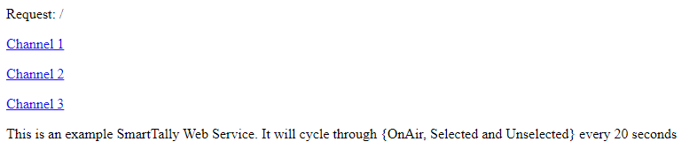

# Smart Tally Server Simulator

**Author:** mqshaw

**A Roland Smart Tally Server Simulator**

This python script is so that you can simulate having a Roland V-60HD video switcher for testing and debugging purposes when building STAC. The script is designed to use port 8080, and you can configure the IP address custom to your machine. This handy little script make verifying your STAC much simpler.

The server supports 3 Smart Tally channels. Each channel switches between off-line, preview and on-air on a 20 second rotation.

### Usage

1. Install the Python 3 library
2. Open the MyTallyServer.py script in the Python IDLE
3. Change the IP address on line 7 to match that of your PC (192.168.x.x)
4. Run the script (F5)

To test the server, open a web browser and navigate to the server, where 192.168.x.x is your servers IP address.

    http://192.168.x.x:8080

When the web page opens up, it should look something like this

Clicking on the individual channels will tell you if they are unselected, selected (preview) or on-air (live).

### Requirements

This server has been written using Python 3, you can download the latest Python installation from https://www.python.org/

---
### Revision History
**2021-05-11** : First release
**2021-05-17** : Minor documentation fix
