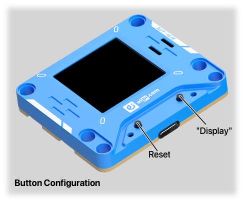

# AI PI-Lite Users Guide Supplement

This document outlines the differences in the STAC software for the AI PI-Lite.

---

## Buttons

The buttons are the mapped as in the diagram below.

> **Note**
> 
> The AI PI-Lite does not have a dedicated hardware reset button. The STAC emulates this functionality in software. If the button fails to reset the STAC, remove power from the device (USB cable and/or the battery pack), wait a tick or two then reconnect power and press the Reset button.

---

## Display

The AI PI-Lite has an LCD display which brings some changes to the icons used.

### Configuration

The setup or configuration icon appears as a gear.

    

### Factory Reset

The factory reset icon appears as a gear "go back" arrow arc.

### Brightness Setting

When setting the display brightness, the background appears as a red and green checkerboard with an overlay of the selected brightness on a black square.

### Unselected Tally Status

An unselected tally sate appears as a black and purple checkerboard with an overlay of the orange "power on" indicator.

### Orientation

This device does not have an IMU so the display is always oriented with the baseline where the USB port is located.

## Peripheral Mode

The AI PI-Lite does not support Peripheral Mode, so kinda makes sense that there is no way to enter Peripheral Mode or to return to Normal Mode operation.

As a result, the "display button down at startup" sequence will not show the "P" or "N" letters but will first show the configuration icon. 

<!-- EOF -->
