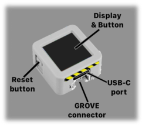

# M5Stack ATOM S3R Users Guide Supplement

This document outlines the differences in the STAC software for the M5Stack ATOM S3R.

---

## Button

The ATOM S3R display,like the ATOM MATRIX is also the User button. Button interaction follows the same single-button conventions as the M5Stack ATOM Matrix — refer to the *STAC Users Guide* for the full interaction model.

### Reset

The ATOM S3R uses a dedicated hardware reset MCU (PMS150G-U6). A brief press of the reset button (the smaller button on the side) will restart the device normally. Holding the reset button for approximately 2 seconds places the device into firmware download mode — a small status LED by the reset button will illuminate green to confirm this state. That is not usually what we want to do when using the S3R as a STAC. Releasing and then a short click of the reset button will do a normal reset of the S3R.

If the device becomes unresponsive and the reset button fails to recover it, remove power (USB cable), wait a couple of seconds, then reconnect.

---

## Display

The ATOM S3R has a 0.85" IPS LCD display (128×128 px) which brings some changes to the icons used.

### Orientation

The ATOM S3R has an IMU and does respect the physical orientation of the device — the display will rotate to match whichever edge is facing down.

### Configuration

The setup or configuration icon appears as a gear.

    

### Factory Reset

The factory reset icon appears as a gear "go back" arrow arc.

### Brightness Setting

When setting the display brightness, the background appears as a red and green checkerboard with an overlay of the selected brightness on a black square.

### Unselected Tally Status

An unselected tally state appears as a black and purple checkerboard with an overlay of the orange "power on" indicator.

---

## Peripheral Mode

### Operating in Peripheral Mode

The ATOM S3R supports Peripheral Mode by monitoring the state of GPIO 1 and GPIO 2 on the GROVE Port A connector as per the table below.

<table>
	<tbody>

		<tr>
			<td rowspan="2">
<b>GPIO 2 (TS_1)</b>
</td>
			<td rowspan="2">
<b>GPIO 1 (TS_0)</b>
</td>
			<td colspan="2">
<b>Displayed Tally State
</td>
		</tr>
		<tr>
			<td>
<b>Talent
</b></td>
			<td>
<b>Camera Operator
</b></td>
		</tr>
		<tr>
			<td>
0
</td>
			<td>
0
</td>
			<td>
PVW
</td>
			<td>
X
</td>
		</tr>
		<tr>
			<td>
0
</td>
			<td>
1
</td>
			<td>
PVW
</td>
			<td>
UNSELECTED
</td>
		</tr>
		<tr>
			<td>
1
</td>
			<td>
0
</td>
			<td>
PVW
</td>
			<td>
PVW
</td>
		</tr>
		<tr>
			<td>
1
</td>
			<td>
1
</td>
			<td>
PGM
</td>
			<td>
PGM
</td>
		</tr>
	
</tbody>
</table>

**Where:** 
&nbsp;&nbsp;&nbsp;**1** = logic high (3.3V) 
&nbsp;&nbsp;&nbsp;**0** = logic low (0V) 
&nbsp;&nbsp;&nbsp;**PVW** (Preview, Standby, Selected) = GREEN 
&nbsp;&nbsp;&nbsp;**PGM** (Program, Live, On Air) = RED 
&nbsp;&nbsp;&nbsp;**UNSELECTED** = Purple checkerboard pattern 
&nbsp;&nbsp;&nbsp;**X** (Unknown) = Orange X

> **Note:**
> 
> Be aware that the GPIO pins use 3.3V logic levels and are not 5V tolerant. Driving any GPIO pin beyond 3.3V will irreparably damage the device.

### Normal State (Controller) Output

When operating in **normal state** (not Peripheral Mode), the ATOM S3R outputs its current tally state to the GROVE Port A connector on GPIO 1 and GPIO 2 as per the table below.

| GPIO 2 (TS_1) | GPIO 1 (TS_0) | ROLAND SWITCH TALLY STATE |
|:---:|:---:|:---:|
| 0 | 0 | UNKNOWN |
| 0 | 1 | UNSELECTED |
| 1 | 0 | PVW |
| 1 | 1 | PGM |

**Where:** 
&nbsp;&nbsp;&nbsp;**1** = logic high (3.3V output) 
&nbsp;&nbsp;&nbsp;**0** = logic low (0V output)

<!-- EOF -->
